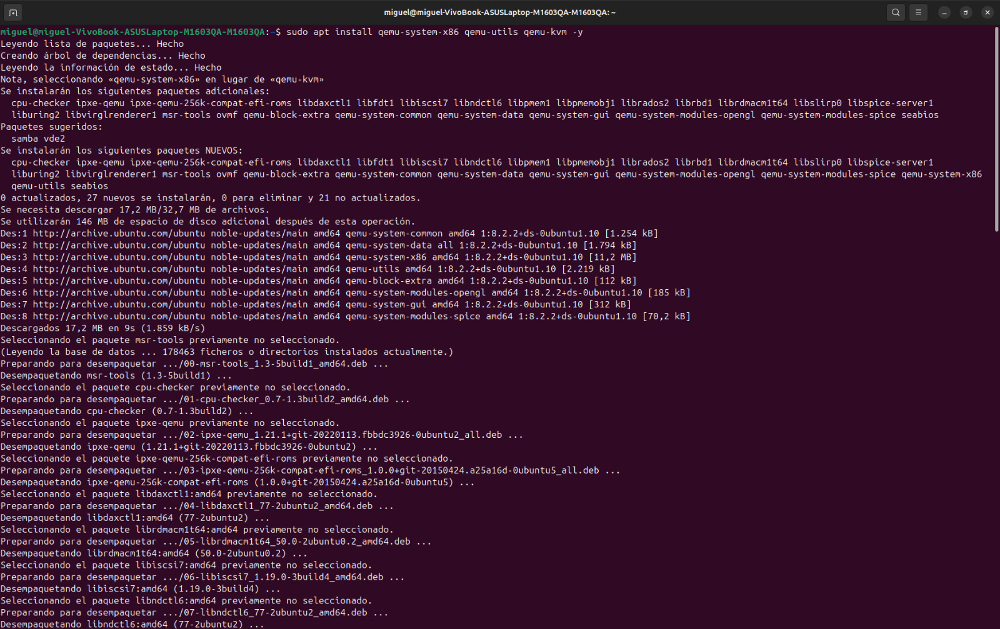
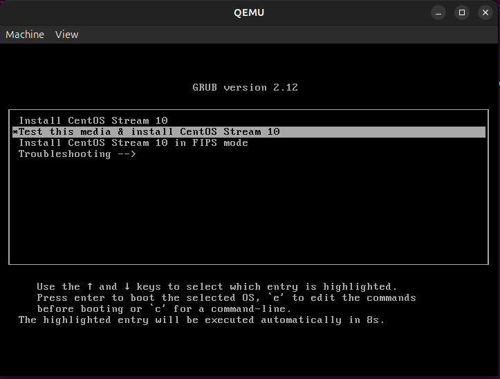
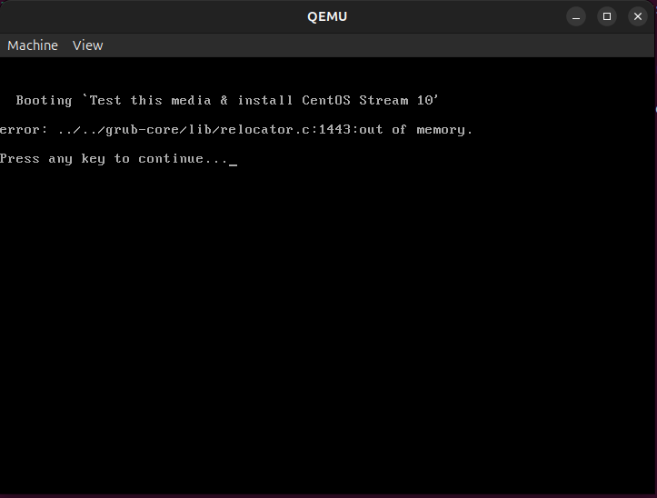
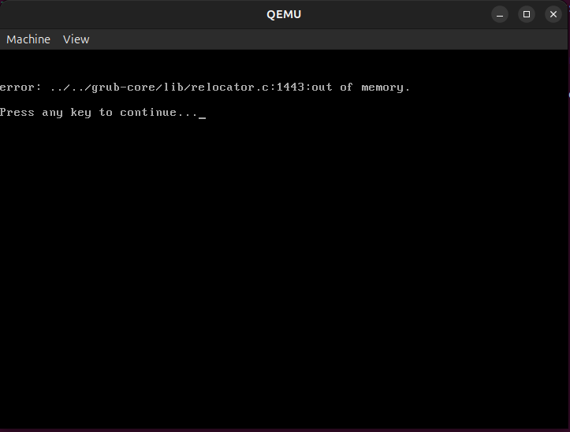
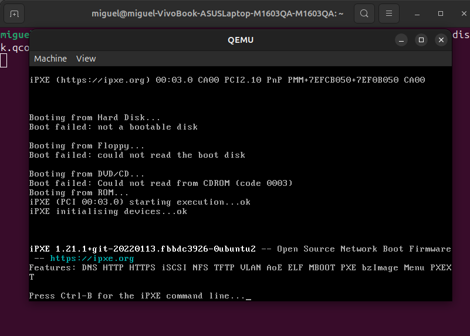

<!DOCTYPE html>
<html lang="es">
<head>
  <meta charset="UTF-8">
  <meta name="viewport" content="width=device-width, initial-scale=1.0">

  
  
</head>
<body>

  <h1>Análisis de Red con Nmap y Virtualización con QEMU</h1>

  <h2>1. Punto 1 — PDF adjunto</h2>
  

    El <strong>PDF “Tarea 5”</strong> adjunto contiene la <strong>solución del primer punto del taller</strong>,
    que corresponde a la investigación sobre <strong>los tipos de sistemas operativos que existen en el mercado</strong>.
    En dicho documento se clasifican los sistemas operativos, se describen sus principales características y se presentan
    ejemplos representativos de cada tipo.
  

  

  <h2>2. Análisis de red con Nmap</h2>
  

    Se realizó un <strong>análisis completo de la red local</strong> utilizando <strong>Nmap</strong> para descubrir hosts activos,
    escanear puertos, identificar servicios y ejecutar scripts de seguridad.
    La evidencia del proceso se encuentra en el archivo <strong>image.png</strong>.
  

  <h3>Comandos ejecutados</h3>

  <h4>Descubrimiento de hosts en la red</h4>
  <pre><code>sudo nmap -sn 192.168.1.0/24</code></pre>
  
<strong>Propósito:</strong> Identificar todos los dispositivos activos dentro de la red local.

  <h4>Escaneo básico del router</h4>
  <pre><code>sudo nmap -sS -sV 192.168.1.1</code></pre>
  
<strong>Propósito:</strong> Analizar los puertos abiertos y los servicios activos del router o gateway.

  <h4>Escaneo completo local</h4>
  <pre><code>sudo nmap -sS -sV -sC -O localhost</code></pre>
  
<strong>Propósito:</strong> Realizar un escaneo exhaustivo de la máquina local, incluyendo detección de sistema operativo y ejecución de scripts básicos.

  <h4>Análisis de seguridad</h4>
  <pre><code>sudo nmap --script safe 192.168.1.1</code></pre>
  
<strong>Propósito:</strong> Ejecutar scripts de seguridad seguros (“safe”) para identificar configuraciones potencialmente inseguras.

  

    
<strong>Evidencia:</strong>

    
  

  

  <h2>3. Virtualización con QEMU</h2>
  

    Se instaló y configuró <strong>QEMU</strong> para crear y ejecutar una máquina virtual con <strong>CentOS Stream 10</strong>.
    Las evidencias del proceso de virtualización están en los archivos
    <strong>qemu1.png</strong>, <strong>qemu2.png</strong>, <strong>qemu3.png</strong> y <strong>qemu4.png</strong>.
  

  <h3>Comandos ejecutados</h3>

  <h4>Instalación de QEMU</h4>
  <pre><code>sudo apt update && sudo apt install qemu-system-x86 qemu-utils qemu-kvm -y</code></pre>

  <h4>Creación de disco virtual</h4>
  <pre><code>qemu-img create -f qcow2 disk.qcow2 10G</code></pre>
  
<strong>Propósito:</strong> Crear un disco virtual de 10 GB en formato <code>qcow2</code>.

  <h4>Configuración y ejecución de la máquina virtual</h4>
  <pre><code>qemu-system-x86_64 -hda disk.qcow2 -cdrom /home/miguel/Descargas/CentOS-Stream-10-latest-x86_64-dvd1.iso -boot d -m 2G -vga virtio -display gtk</code></pre>
  
<strong>Propósito:</strong> Iniciar la instalación de <strong>CentOS Stream 10</strong> con una interfaz gráfica, 2 GB de memoria y salida de video por <code>virtio</code>.

  

    
<strong>Evidencias del proceso:</strong>

    
    
    
    
  

  

</body>
</html>
